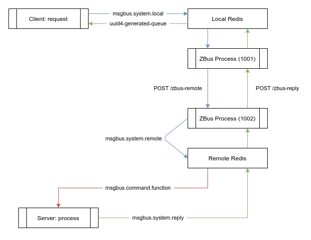

# Reliable Message Bus Protocol

## Server

To run `msgbusd` (msgbus daemon) which is the server (aka agent) running to process messages, you can use
the following:

```
msgbusd --twin <twin-id>
```

More options are available:

```
  --redis [redis-endpoint]
  --substrate [substrate-http]
```

- The `twin-id` is mendatory and will be used to identify messagebus identifier
- The redis address can be used to specify a running redis server, it can be an address
  (eg: `127.0.0.1:6379`, this is the default value) or a unix socket (eg: `/var/run/redis.sock`)
- The substrate argument should be a valid http webservice made to query substrate db

## Run systemd service

- download the latest binary and move it to bin dir
- This command create a unit file for systemd service named `msgbus.service`

  ```bash
  # create msgbus service
  cat << EOF > /etc/systemd/system/msgbus.service
  [Unit]
  Description=message bus server
  After=network.target

  [Service]
  ExecStart=msgbus --twin TWIN-id [options]
  Type=simple
  Restart=always
  User= $USER
  Group= $USER

  [Install]
  WantedBy=multi-user.target
  Alias=msgbus.service
  EOF
  ```

- enable the service
  ```
   systemctl enable msgbus.service
  ```
- start the service
  ```
  systemctl start msgbus.service
  ```

- check the status

  ```
  systemctl status msgbus.service
  ```

  you have to see some think like this

  ```bash
  ➜ systemctl status msgbus.service
  ● msgbus.service - message bus server
      Loaded: loaded (/etc/systemd/system/msgbus.service; disabled; vendor preset: enabled)
      Active: active (running) since Thu 2021-11-18 11:08:41 EET; 1min 48s ago
    Main PID: 81090 (msgbus)
        Tasks: 9 (limit: 18834)
      Memory: 6.5M
      CGroup: /system.slice/msgbus.service
              └─81090 /usr/local/bin/msgbus --twin 24

  نوف 18 11:08:41 ayoub-Inspiron-3576 systemd[1]: Started message bus server.
  نوف 18 11:08:41 ayoub-Inspiron-3576 msgbus[81090]: 2021/11/18 11:08:41 Connecting to wss://tfchain.dev.grid.tf/ws...
  نوف 18 11:08:42 ayoub-Inspiron-3576 msgbus[81090]: 2021-11-18T11:08:42+02:00 info initializing agent server twin=24
  ```

## Specification

Object Schema:

```js
{
  "ver": 1,                                # version identifier (always 1 for now)
  "uid": "",                               # unique id (filled by server)
  "cmd": "wallet.stellar.balance.tft",     # command to call (aka function name)
  "exp": 3600,                             # expiration in seconds (relative to 'now')
  "try": 4,                                # amount of retry if remote cannot be joined
  "dat": "R0E3...2WUwzTzdOQzNQUlkN=",      # data base64 encoded
  "src": 0,                                # source twin id (filled by server)
  "dst": [1002],                           # list of twin destination id (filled by client)
  "ret": "5bf6bc...0c7-e87d799fbc73",      # return queue expected (please use uuid4)
  "shm": "",                               # schema definition (not used now)
  "now": 1621944461,                       # sent timestamp (filled by client)
  "err": ""                                # optional error (would be set by server)
}
```

This structure is used by client and server, everything is following this structure and theses field type.

Note, on this documentation, `local side` mean the digitaltwin/bus process where the message were sent.
The `remote side` is where the destination is. In practice, this can be the same twin (for inter-process
communication, for example). Queue usage are made to allow this.

### Sending a request

To send a request (aka call a remote function), you push your request (the json above) to your
local redis `msgbus.system.local` queue using `RPUSH` command.

The client can now wait on the `ret` queue for responses. Amount of expected responses is the same as length
of destination requested (here, only one: `1002`), so only a single response should arrive.

Responses arrives one by one.

### Processing a request

The ZBus process is waiting on `msgbus.system.local` for incoming messages. As soon as a message is received,
the bus process resolve destinations id (fetch ip/port from tfgrid), then forward the request to destination
zbus-server over HTTP. Each zbus server listen to `/zbus-remote` and `/zbus-reply` HTTP POST endpoint.

This method allows redis to only listen locally and inter-zbus talks to each other using HTTP.

To forward the request, `ZBus Process` rewrite `dst` field to only put single destination (the expected one by remote)
and set the `src` field with it's own digitaltwin id. An internal counter is incremented, based on remote id.
This id and counter is used to create the `uid` field which is `unique id` to identify the message
(eg: `'1002.174'` for the `174th` message to destination `1002`).

Bus process rewrite the original request to this:

```js
{
  "ver": 1,                                # version identifier (always 1 for now)
  "uid": "1002.117",                       # unique id (filled by server)
  "cmd": "wallet.stellar.balance.tft",     # command to call (aka function name)
  "exp": 3600,                             # expiration in seconds (relative to 'now')
  "try": 4,                                # amount of retry if remote cannot be joined
  "dat": "R0E3...2WUwzTzdOQzNQUlkN=",      # data base64 encoded
  "src": 1001,                             # source twin id (filled by server)
  "dst": [1002],                           # list of twin destination id (filled by client)
  "ret": "5bf6bc...0c7-e87d799fbc73",      # return queue expected (please use uuid4)
  "shm": "",                               # schema definition (not used now)
  "now": 1621944461,                       # sent timestamp (filled by client)
  "err": ""                                # optional error (would be set by server)
}
```

In case of error (eg: requested destination not found), the `err` field is filled with explicit text error
and the response is directly pushed to `ret` queue.

```js
...
  "err": "destination not found",
...
```

If everything is okay, the remote bus server will receive this request over HTTP and push it to local redis
to `msgbus.system.remote` queue of the and replace `ret` field by `msgbus.system.reply`.

A copy of this request is stored in local redis `HSET msgbus.system.backlog` with `uid` as key. This
backlog is used to match reply with corresponding original request, to ensure reply comes from a legitim request
and save original reply queue.

### Processing a request on the remote side

On the remote side, a local redis and another `ZBus Process` is running. The `ZBus Process` is waiting event on
HTTP POST `/zbus-remote` and will transfert legit request to local redis queue `msgbus.system.remote`.
This queue will be proceed by main task and parse request sent by `1001`.

The message is forwarded **as it** to `msgbus.$cmd` queue. An application should wait for message on that
queue to process the request and send the reply to the `msgbus.system.reply` local queue.

The application should swap `dst` and `src`, set the `dat` with response payload (base64 encoded) and update
`now` field with response time.

### Processing a reply, on the remote side

When a reply is found by `ZBus Process` on the remote side, in the queue `msgbus.system.reply`, this message
is extracted from the queue.

Because the destination id doesn't match with the local id, the message is forwarded **as it** to `dst`
server (resolved), over HTTP POST `/zbus-reply`.

### Processing a reply, on the local side

When receiving a message over HTTP POST `/zbus-reply`, the legit request is copied into `msgbus.system.reply` queue
and will be parsed by main redis task. The same way as remote side, when a message will be found on
the `msgbus.system.reply` queue, but this time the `dst` id will match with local id, so the `ZBus Process`
knows this reply was for him.

The `uid` from that reply is used to fetch back the original message from the `HSET msgbus.system.backlog`. This
allow the process to find back the original `ret` queue. The `ret` is replaced with original value and this
message is then forwarded to that specific queue.

### The response is available on the return queue

Source application now get the reply message on it's expected queue.

```js
{
  "ver": 1,
  "uid": "1002.117",
  "cmd": "wallet.stellar.balance.tft",
  "exp": 3600,
  "try": 4,                                  # amount of retry left when proceed
  "dat": "MTgwMjQ4ODQuMTM5MzQxOQ==",         # response base64 encoded
  "src": 1002,
  "dst": [1001],
  "ret": "5bf6bc...0c7-e87d799fbc73",
  "shm": "",
  "now": 1621944462,                         # response generated time
  "err": ""
}
```

## The RMB allow also interaction using HTTP requests

- there is two endpoints available:

  1. `/zbus-cmd`: For submitting message and adding it to the remote queue for processing.
     - this endpoint will process the cmd and keep the result in a redis queue with unique id
     - response: The response from this endpoint will be a `MessageIdentifier` object contain the unique id generated for every message to get the message result from it vie the another endpoint `/zbus-result`.
       ```go
       type MessageIdentifier struct {
         Retqueue string `json:"retqueue"`
       }
       ```
  2. `/zbus-result`: For get the message result from its redis queue
     - get a `MessageIdentifier` object
     - response: The response from this endpoint will be a list of messages from the redis queue.

### Schema


